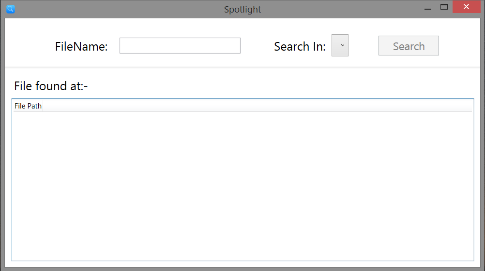
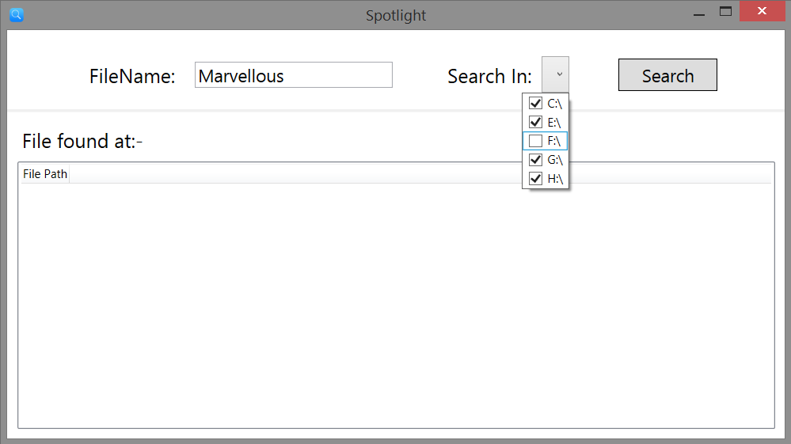
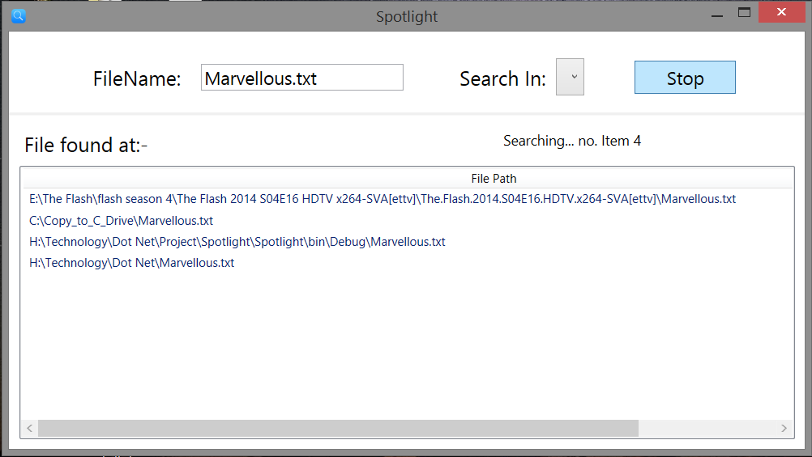
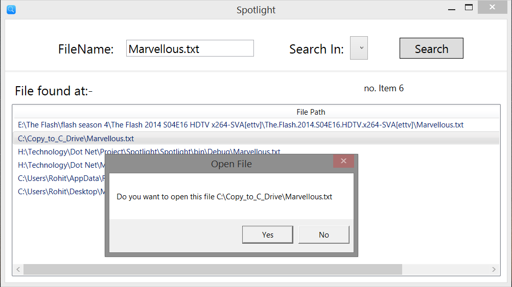
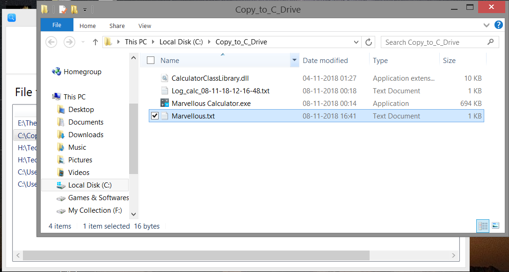

# MicroSoft SpotLight

This project is used to locate targeted file in whole harddisk in less time.

- __Framework:__ Dot Net.
- __Front End:__ Windows Presentation Foundation (WPF)
- __Back End:__ C#.
- __Platform:__ Windows.

---

## Features

- This project search specific file by using multiple threads simultaneously.
- Due to multithreading application it locate file in minimum time.
- You can also specify which drive you want to search.
- After searching you can double click the file to open the directory where this file is present.

---
## Project ScreenShot

1. First Look.

---

2. You can specify in which drive you want to search file

---

3. When you click search button.

---

4. Completing Searching

---

5. You can open displayed file by double clicking it.

---

6. File location is open explorer.exe

---